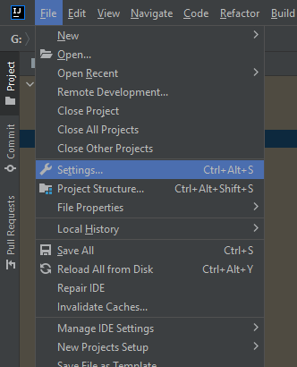

Установка и запуск Backend-клиента:
1. Установить Intellij Idea(https://www.jetbrains.com/ru-ru/idea/download/#section=windows)
2. После установки требуется выбрать проект: Backend-клиента расположен в source/backendSolution
3. Открываем настройки
4.  
4. Открываем раздел Plugins,  вкладку Marketplace и загружаем плагин Ktor

5. Переходим в файл src/main/resources/application.conf и изменяем в issuer и audience "192.168.0.103" на локальный адресс устройство, с которого будет происходить запуск
6. После чего переходим в файл scr/main/kotlin/stark/io/Application.kt
7. Дожидаемся окончания сборки(индикация справа внизу экрана)
8. Нажимаем на иконку запуска

